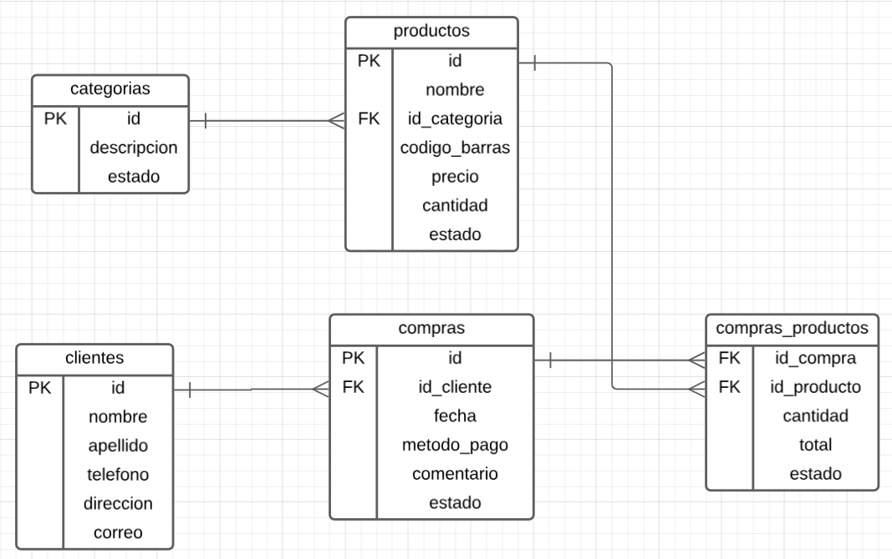

## Rest API | Market | Spring Boot

### Technology used
* [`Spring Web`](https://mvnrepository.com/artifact/org.springframework.boot/spring-boot-starter-web)
* [`Spring Data JPA`](https://mvnrepository.com/artifact/org.springframework.boot/spring-boot-starter-data-jpa)
* [`Flyway`](https://mvnrepository.com/artifact/org.flywaydb/flyway-core)
* [`Postgresql`](https://mvnrepository.com/artifact/org.postgresql/postgresql)
* [`MapStruct`](https://mapstruct.org/)
* [`Lombok`](https://projectlombok.org/)
### Project description
This project is part of platzi course "Curso de Java Spring". Rest API with Spring for market.
 
Entities: 
`clientes` 
`productos` 
`categorias` 
`compras` 
`compras_productos` 

### BD diagram

